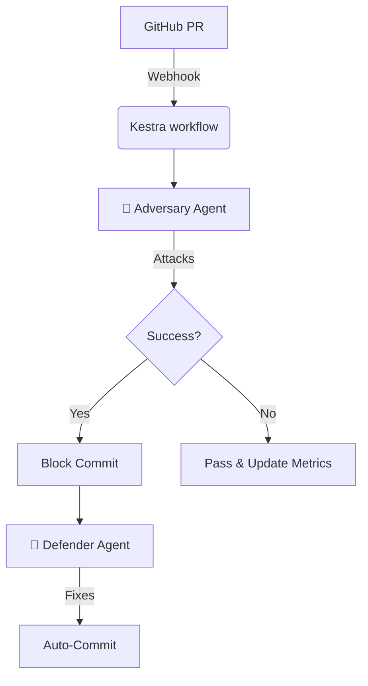

# ⭕ Project RedLoop: Adversarial DevSecOps Autopilot

> **Mission**: The first **Zero-Cost** adversarial AI security agent that attacks your code before hackers do.

## 🛡️ What is RedLoop?

RedLoop is an autonomous DevSecOps agent that operates on a "Security-Through-Attack" principle. Instead of just scanning code for vulnerabilities, it **actively exploits them** in a safe environment to prove risk, and then automatically fixes them.

It combines:
- 🔴 **Red Team**: An Adversary Agent (powered by Gemini 2.5 Pro / Ollama) that generates novel attack payloads.
- 🔵 **Blue Team**: A Defender Agent (Cline CLI) that patches vulnerabilities.
- 🔄 **The Loop**: Orchestrated by Kestra to run on every Pull Request.

## 🚀 Features

- **Adversarial Testing**: RAG-augmented generation of SQLi, XSS, and Logic exploits.
- **Zero-Cost Architecture**: Runs entirely on Free Tier APIs or Local Compute.
- **Attack Replay**: Watch an animated replay of exactly how your code was broken.
- **Security Genome**: Tracks your codebase's immunity over time.

## 🏗️ Architecture



## 🛠️ Usage

1. **Install Dependencies** (using [uv](https://docs.astral.sh/uv/)):
   ```bash
   uv sync
   ```

2. **Set up Environment**:
   ```bash
   cp .env.example .env
   # Add GEMINI_API_KEY if using cloud mode
   ```

3. **Run Adversary Test**:
   ```bash
   python scripts/test_adversary.py
   ```

## 🏆 Hackathon Tracks
Built for **AI Agents Assemble 2024**.
- **Infinity Gauntlet** (Cline)
- **Wakanda Data** (Kestra)
- **Stormbreaker** (Vercel)
