# ⭕ RedLoop

### Adversarial AI Security Agent

[](https://github.com/haroon0x/RedLoop/actions/workflows/ci.yml)
[](https://opensource.org/licenses/Apache-2.0)
[](https://coderabbit.ai)
[](https://kestra.io)
[](https://vercel.com)

> **The first adversarial AI security agent that attacks your code before hackers do.**

<p align="center">
  
  
  
</p>

---

## 🛡️ What is RedLoop?

RedLoop is an **autonomous AI security agent** that operates on a **"Security-Through-Attack"** principle. Instead of just scanning for vulnerabilities, it **actively exploits them** in a safe environment to prove risk, then automatically generates fixes.

### The 3-Agent Loop

| Agent | Role | Technology |
|-------|------|------------|
| 🔴 **Adversary** | Find vulnerabilities, generate attack payloads | Cline CLI / Kestra AI Agent |
| 🤖 **Summarizer** | Analyze risks, make BLOCK/PASS decisions | Kestra AI Agent |
| 🔵 **Defender** | Generate secure code fixes | Cline CLI / Kestra AI Agent |

---

## ✨ Features

- 🔍 **Multi-source Scanning** - GitHub URLs, code paste, file uploads
- 🎯 **Adversarial Analysis** - Generates actual attack payloads
- 🤖 **AI-Powered Decisions** - BLOCK or PASS based on severity
- 🔧 **Auto-Fix Generation** - Secure code patches for vulnerabilities
- 📊 **Risk Scoring** - Executive summaries with priority rankings
- 🖥️ **CLI Tool** - `redloop scan .` from your terminal
- 🌐 **Dashboard** - Real-time vulnerability visualization

---

## 🏗️ Architecture

```
redloop/
├── backend/          # FastAPI Python Backend
│   ├── app/
│   │   ├── core/     # Adversary & Defender agents
│   │   ├── api/      # REST endpoints
│   │   └── models/   # Pydantic schemas
│   ├── cli/          # CLI tool (redloop command)
│   └── kestra/       # Workflow definitions
├── frontend/         # Next.js Dashboard
├── data/             # Attack vectors database
└── prompts/          # Agent system prompts
```

### Workflow

```mermaid
graph TD
    A[📥 Code Input] -->|GitHub URL / Paste / Upload| B(Kestra Workflow)
    B --> C[🔴 Adversary Agent]
    C -->|Vulnerabilities| D[🤖 Summarizer Agent]
    D -->|BLOCK/PASS Decision| E{Decision?}
    E -->|BLOCK| F[🔵 Defender Agent]
    F -->|Fixes| G[📤 Return Results]
    E -->|PASS| G
    
    style C fill:#ff6b6b
    style D fill:#9b59b6
    style F fill:#3498db
```



---

## 🚀 Quick Start

### Prerequisites

- Python 3.11+
- [uv](https://github.com/astral-sh/uv) (Python package manager)
- Node.js 18+ (for frontend)

### Backend

```bash
cd backend
uv sync
uv run uvicorn app.main:app --reload
```

### Frontend

```bash
cd frontend
npm install
npm run dev
```

### CLI (Coming Soon)

```bash
# Install
uv tool install redloop

# Scan current directory
redloop scan .

# Scan with auto-fix
redloop scan . --fix

# Output JSON for CI/CD
redloop scan . --output json
```

---

## 📡 API Reference

| Method | Endpoint | Description |
|--------|----------|-------------|
| `GET` | `/api/health` | Health check |
| `POST` | `/api/scan` | Scan code (URL, paste, or file) |
| `POST` | `/api/fix` | Generate fixes for vulnerabilities |
| `POST` | `/api/scan/kestra` | Trigger full Kestra workflow |
| `GET` | `/api/scan/kestra/{id}` | Get Kestra execution result |

### Example: Scan Code

```bash
curl -X POST http://localhost:8000/api/scan \
  -H "Content-Type: application/json" \
  -d '{
    "code": "def login(user):\n    query = f\"SELECT * FROM users WHERE name={user}\"",
    "filename": "auth.py"
  }'
```

### Response

```json
{
  "vulnerabilities": [
    {
      "id": "VULN-001",
      "type": "SQL Injection",
      "severity": "CRITICAL",
      "file": "auth.py",
      "line": 2,
      "description": "User input directly concatenated in SQL query",
      "payload": "' OR '1'='1",
      "fix_suggestion": "Use parameterized queries"
    }
  ],
  "count": 1,
  "decision": "BLOCK",
  "risk_score": 9
}
```

---

## 🔧 Configuration

### Environment Variables

```env
# Required
GEMINI_API_KEY=your-gemini-api-key

# Optional - GitHub OAuth for private repos
GITHUB_CLIENT_ID=xxx
GITHUB_CLIENT_SECRET=xxx

# Optional - Kestra integration
KESTRA_URL=https://your-kestra.kestra.cloud
KESTRA_API_KEY=xxx
```

---

## 🧪 Supported Vulnerability Types

| Category | Examples |
|----------|----------|
| 💉 **Injection** | SQL Injection, Command Injection, LDAP Injection |
| 🌐 **XSS** | Reflected XSS, Stored XSS, DOM-based XSS |
| 🔐 **Authentication** | Broken auth, session hijacking, weak passwords |
| 🚪 **Access Control** | IDOR, privilege escalation, path traversal |
| 🖥️ **RCE** | Remote code execution, deserialization |
| 🤖 **AI/LLM** | Prompt injection, jailbreaks, data poisoning |

---

## 🛠️ Tech Stack

| Component | Technology |
|-----------|------------|
| Backend | FastAPI, Python 3.11+, Pydantic |
| AI/LLM | Google Gemini 2.0, Kestra AI Agent |
| CLI | Typer, Rich |
| Frontend | Next.js, Tailwind CSS |
| Orchestration | Kestra |
| Deployment | Vercel |
| Code Review | CodeRabbit AI |

---

## 🤝 Contributing

We welcome contributions! Please see our [Contributing Guidelines](CONTRIBUTING.md).

### Development Setup

1. Fork the repository
2. Clone your fork:
   ```bash
   git clone https://github.com/YOUR_USERNAME/RedLoop.git
   cd RedLoop
   ```
3. Create a branch:
   ```bash
   git checkout -b feature/your-feature-name
   ```
4. Make your changes
5. Run tests:
   ```bash
   cd backend && uv run pytest
   ```
6. Submit a Pull Request

### Code Quality

This project uses:
- **CodeRabbit** for AI-powered PR reviews
- **Ruff** for Python linting
- **Pre-commit hooks** for code formatting

---

## 📊 Project Status

| Feature | Status |
|---------|--------|
| GitHub URL Scanning | 🚧 In Progress |
| Code Paste Scanning | 🚧 In Progress |
| Kestra AI Agent Integration | 🚧 In Progress |
| CLI Tool | 📋 Planned |
| Vercel Deployment | 📋 Planned |
| File Upload | 📋 Planned |

---

## 🏆 Hackathon

This project is built for the **[AI Agents Assemble](https://wemakedevs.org/events/ai-agents-assemble)** hackathon (Dec 8-14, 2024).

### Technologies Used

- ⚡ **Kestra** - AI Agent workflow orchestration
- 🖥️ **Cline** - CLI-based code automation
- 🚀 **Vercel** - Production deployment
- 🤖 **CodeRabbit** - AI-powered code reviews

---

## 📄 License

This project is licensed under the Apache 2.0 License - see the [LICENSE](LICENSE) file for details.

---

## 👥 Team

Built with ❤️ by the RedLoop team.

---

<p align="center">
  <b>🔴 Attack → 🤖 Decide → 🔵 Defend → 🔄 Loop</b>
</p>
