# ⭕ RedLoop: Adversarial DevSecOps Autopilot

[](https://github.com/haroon0x/RedLoop/actions/workflows/ci.yml)
[](https://opensource.org/licenses/Apache-2.0)

> **Mission**: The first **Zero-Cost** adversarial AI security agent that attacks your code before hackers do.

## 🛡️ What is RedLoop?

RedLoop is an autonomous DevSecOps agent that operates on a "Security-Through-Attack" principle. Instead of just scanning code for vulnerabilities, it **actively exploits them** in a safe environment to prove risk, and then automatically fixes them.

- 🔴 **Red Team**: An Adversary Agent (powered by Gemini 2.5 Pro / Cline) that generates novel attack payloads
- 🔵 **Blue Team**: A Defender Agent that patches vulnerabilities
- 🔄 **The Loop**: Continuous feedback cycle on every Pull Request

## 🏗️ Architecture

```
├── backend/          # FastAPI Python Backend (uv)
│   └── app/
│       ├── core/     # Adversary & Defender agents
│       ├── api/      # REST endpoints
│       └── models/   # Pydantic schemas
├── frontend/         # Next.js Dashboard
├── data/             # Attack vectors database
└── prompts/          # Agent system prompts
```



```mermaid
graph TD
    A[GitHub PR] -->|Webhook| B(Kestra workflow)
    B --> C[🔴 Adversary Agent]
    C -->|Attacks| D{Success?}
    D -->|Yes| E[Block Commit]
    E --> F[🔵 Defender Agent]
    F -->|Fixes| G[Auto-Commit]
    D -->|No| H[Pass & Update Metrics]
```

## 🚀 Quick Start

### Backend
```bash
cd backend
uv sync
uv run uvicorn app.main:app --reload
```

### Frontend
```bash
cd frontend
npm install
npm run dev
```

### API Endpoints
- `GET /api/health` - Health check
- `POST /api/scan` - Run security scan
- `POST /api/fix` - Generate patches


## 📄 License

Apache 2.0 - See [LICENSE](LICENSE)
